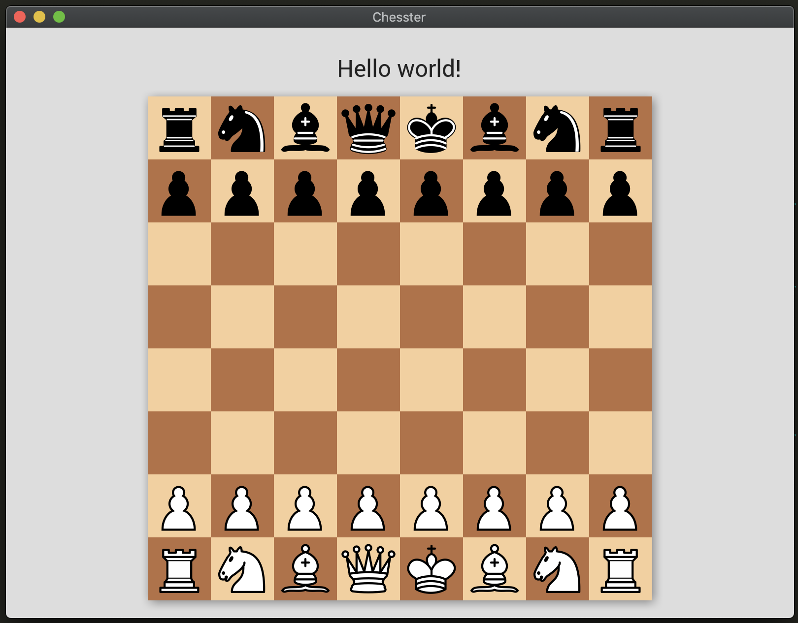

# Chesster

A chess app written in Reason ♟️♟️♟️

# Progress

Current progress: Can play a game of chess. Only legal moves should be accepted. Drag & drop doesn't work the best, so make moves slowly. Can only promote to queen for now.

# Development

## Primary commands

- `esy` - Builds and installs
- `esy format` - Runs refmt on all source code
- `esy test` - Runs Rely tests
- `esy run` - Launches the app

## Dune / directory setup

- `src/App.re`
  - This is the root of the App, but is exported as a library. This is so that
    the test executable can depend on the App source code to test.
- `src/AppExe.re`
  - This is the single file that is the executable to launch the App. It just
    calls the run method in `App.re`. Execute with `esy run`.
- `tests/TestExe.re`
  - This is the test executable. Any reason files in `tests` that
    `open TestFramework` and use `describe` will be registered and run when
    calling `esy test`.
  - See [reason-native/rely](https://reason-native.com/docs/rely/).

## VSCode Extensions

The "reason-vscode" extension doesn't seem to like the multiple dune projects
setup. The "OCaml and Reason IDE" extension works though.
